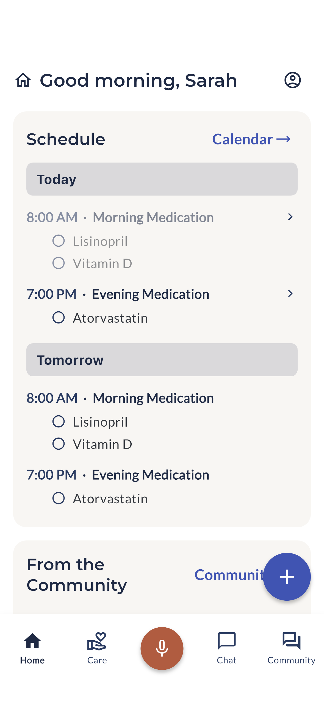
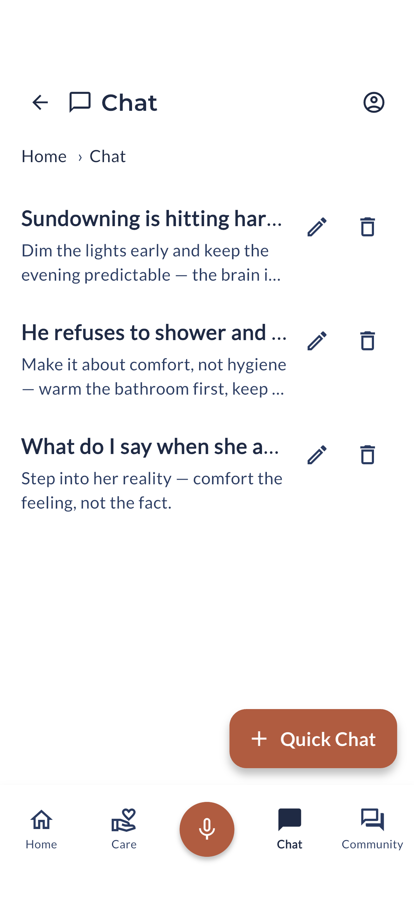
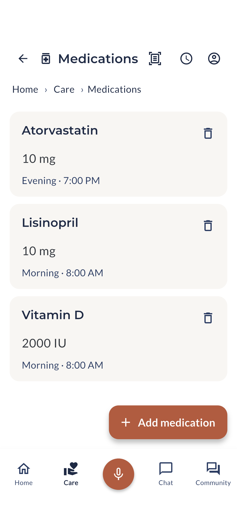
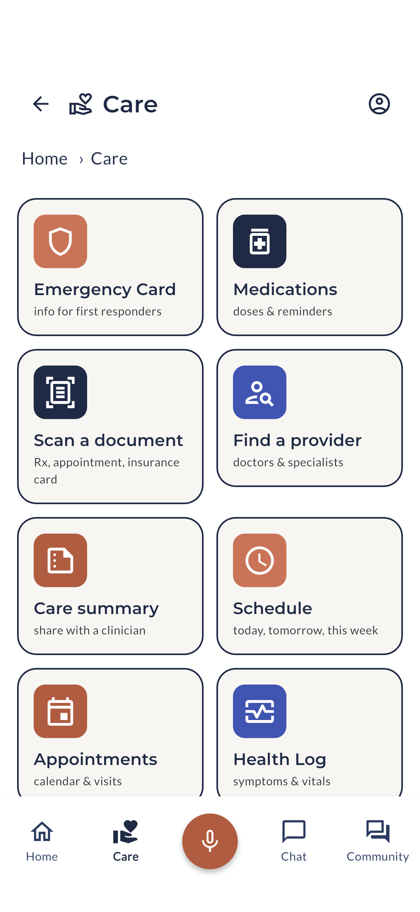
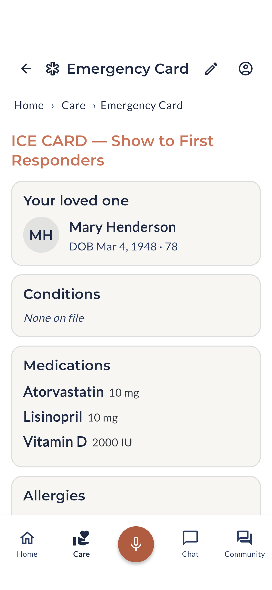
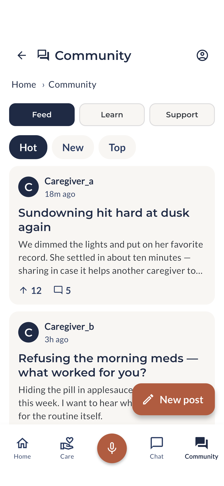

# Holdclose

**An AI coach that actually knows your loved one's situation — wrapped in a full caregiving suite.**

Holdclose is a mobile app (iOS + Android) for family caregivers. Family
caregiving isn't one hard moment — it's thousands of them, usually with no
training and no time to look anything up. Holdclose is the assistant to the
caregiver: it tracks the medications, appointments, and history, and puts a
coach — grounded in your loved one's *real* care data — one tap away for the
hard moments.

It's built for **any** care situation: aging parents, a disabled family member,
post-surgery recovery, dementia. Not one diagnosis.

🌐 **[holdclose.care](https://holdclose.care)** · iOS + Android · in active testing

> **Entry in the ACL / HHS Caregiver AI Prize Challenge — Track 1 (AI for
> family caregivers).** **Dementia caregiving is a first-class use case:** the
> coach is grounded in a loved one's real situation — including dementia
> behaviors, medications, and routines — and the medication + dose-window
> tracking, journal pattern-detection (e.g. repeated falls or agitation), and
> the paramedic-ready Emergency Card are built for the daily realities of
> dementia care, right alongside stroke recovery, post-surgery, and aging-parent
> support.

## Screenshots

<p align="center">
  
  
  
</p>
<p align="center">
  
  
  
</p>

## What makes it different

Anyone can open a chatbot. The wedge here is a coach **grounded in your loved
one's actual care record** — their medications and dose windows, appointments,
history, journal, and care circle — so the guidance fits *your person*, not a
blank box.

## Responsible AI, by design

Holdclose is built to the standard a family deserves, and its guardrails are
structural — they don't depend on which model is running:

- **Coaches the caregiver, never diagnoses the loved one.** No symptom checker,
  no prognosis, no medication-dosing advice. When it's unsure, it says so and
  points to a professional.
- **Human-in-the-loop on every change.** Anything that would alter the care
  record — including a scanned prescription or a voice-logged dose — waits for
  the caregiver to confirm. Destructive actions never auto-execute.
- **The vendor is invisible; the capability isn't.** The AI runs on our own
  cloud (an open-weight model on Cloudflare Workers AI), so care data never
  reaches a separate AI vendor.
- **Validated.** An automated red-team of 41 inference cycles through the real
  coach stack held all 41 safety guardrails (dosing, diagnosis, crisis,
  prompt-injection, and unknown-instruction probes), backed by a code-side
  crisis watchdog and prompt sanitization pinned by the test suite.

## Features

- **Chat coach** — a multi-turn caregiving companion grounded in your loved
  one's care data. Hands-free center-mic voice ("log that she didn't sleep")
  records meds, doses, appointments, and journal entries on your behalf — each
  change confirmed by you first.
- **Medications & dose windows** — track doses so nothing slips, with
  **refill-runway alerts** before a medication runs out.
- **AI scan-to-import** — photograph a prescription, appointment card, or
  insurance card and the AI reads it into structured fields; you review and
  approve before anything is saved. Low-confidence fields are flagged, not
  guessed.
- **Care coordination** — AI doctor-visit-prep questions, AI insurance-appeal
  letter drafts, NPI provider search, a shareable care-summary PDF, and
  tap-to-call for providers, pharmacy, and insurance.
- **Emergency Card** — a paramedic/ER handoff sheet: conditions, medications,
  allergies, and contacts on one screen.
- **Care Circle** — share caregiving across the family with server-backed sync,
  single-use invite links with explicit join confirmation, and a shared
  calendar, tasks, and shifts.
- **Journal & community** — free-text logging with pattern detection, plus a
  caregiver forum and Learn/Support resources.

## Under the hood

Flutter (Dart) · Riverpod · go_router · Drift (SQLite) · a Cloudflare Worker
backend (Hono + D1 + R2 + Workers AI). Care data is **local-first** and
encrypted at rest by the OS; care-circle sync is authenticated and TLS-encrypted.

Quality is enforced by a large automated suite — **~2,000 unit, widget, and
golden tests** plus a backend suite — run on every change.

## Development

```bash
flutter pub get
flutter test                 # full suite (unit + widget + golden)
flutter analyze
cd backend && npm test       # Cloudflare Worker suite
```

The app runs against a backend for auth and sync; a local development shim wraps
a CLI for dev-mode AI calls, so there are no API keys in source.

## About

Holdclose is built by a U.S. Air Force veteran out of his own family's
caregiving experience, and published under **Juno Code Studio** (JCSV One LLC).
It shares a tested backbone with **Care Rounds**, a companion app for the paid
direct-care workforce — two sides of one care team.

Holdclose is an entry in the **ACL / HHS Caregiver AI Prize Challenge**
(Track 1 — AI for family caregivers).

## License

© JCSV One LLC (Juno Code Studio). All rights reserved. The source is made
available for evaluation and is **not** licensed for reuse, redistribution, or
derivative works.
